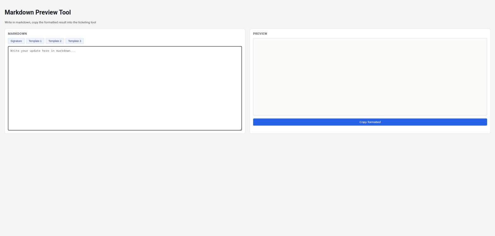

# Markdown Preview Tool

A local tool that turns markdown into rich text you can paste into a
ticketing tool that no longer understands markdown syntax but does
preserve formatting (bold, italic, headings, lists, line breaks) when you
paste already-rendered text.

## In action



## What it does

1. You write your update in markdown in the left panel.
2. The right panel shows a live, rendered preview as you type.
3. Click **Copy formatted** to copy the rendered result to your clipboard
   as rich text.
4. Paste it into the ticketing tool's comment field — the formatting
   (and the font, Courier New 13pt by default) is preserved.

Four extra buttons above the markdown box (**Signature**, **Template 1**,
**Template 2**, **Template 3**) each insert a piece of fixed text at the
end of whatever you've already written, so you don't have to retype your
sign-off or common replies every time. See **Customizing** below to change
what they insert.

## Requirements

- Docker with the `docker compose` plugin (`docker compose version` should
  work in your terminal).

## Installation and running

1. Get the project files onto your machine (clone or copy the repository).
2. From the project's root folder, run:

   ```bash
   docker compose up -d
   ```

   The first run builds a small image (based on `nginx:alpine`) and
   starts a container. This may take a few seconds.
3. Open [http://localhost:8420](http://localhost:8420) in your browser.
4. When you're done, stop it with:

   ```bash
   docker compose down
   ```

Your data never leaves your machine: everything runs locally, there is no
backend and no external network calls once the page is loaded (the
markdown library is bundled, not loaded from a CDN).

### Changing the port

By default the tool is served on port `8420`. To use a different port,
edit `docker-compose.yml`:

```yaml
ports:
  - "8420:80"   # change the first number, e.g. "9000:80"
```

Then restart with `docker compose up -d --build`.

## Customizing the Signature and Templates

The text inserted by the **Signature**, **Template 1**, **Template 2** and
**Template 3** buttons comes from four plain text files in the `snippets/`
folder at the project root:

```
snippets/
├── signature.md
├── template-1.md
├── template-2.md
└── template-3.md
```

To change what a button inserts:

1. Open the corresponding file in any text editor (VS Code, Notepad,
   vim — anything works).
2. Edit the text. You can use markdown syntax here too (bold, italic,
   lists, etc.) — it will be rendered like any other markdown when
   inserted.
3. Save the file.
4. Reload the page in your browser (F5). No need to restart or rebuild
   the container — the files are mounted live into it.

There is no in-browser editor for these files by design: editing a plain
text file is simpler and more reliable than adding a backend just to save
changes from the page, and it means you can back up, version, or copy
your `snippets/` folder like any other file.

**Tip:** each button appends its text to whatever is already in the
markdown box (with a blank line in between if needed), it does not
replace what you've written. Click multiple buttons in sequence if you
want to build up a longer message, or just use **Signature** at the end
of a message you typed yourself.

## Notes

- Any HTML typed directly into the markdown box (e.g. pasted from a web
  page) is shown as plain text rather than being rendered/executed — this
  is intentional, for safety.
- This tool has no automated test suite; everything is verified by using
  it. If something looks wrong, check the browser's developer console for
  errors.

## License

MIT — see [LICENSE](LICENSE).
